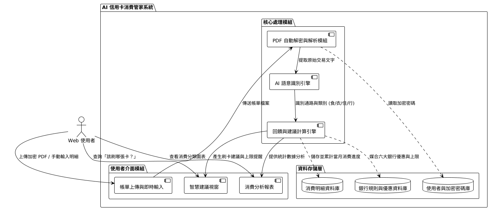

# AI 信用卡消費管家 (AI Credit Card Manager)



這是一個本地端的理財管理工具，旨在協助使用者自動化管理多張信用卡的消費帳單。透過 PDF 解析技術與 **Google Gemini AI**，系統能自動清理雜亂的店家名稱、進行消費分類，並根據預設的各卡回饋規則計算最優回饋金額。

## ✨ 核心功能

*   **🛡️ 加密保險箱 (Vault)**：安全存儲您的 PDF 電子帳單解鎖密碼 (AES-256 加密)。
*   **📄 PDF 自動解析**：支援批次匯入電子帳單，自動擷取交易日期、店家與金額。
*   **🤖 AI 智慧分類**：使用 **Google Gemini (`gemma-4-31b-it`)** 自動將交易歸類為食、衣、住、行等類別。
*   **💰 回饋規則引擎**：自動計算各張信用卡的現金回饋，並追蹤回饋上限 (Cap)。
*   **💡 聰明消費建議**：消費前輸入店家名稱，AI 即時推薦您該刷哪張卡最划算。
*   **📊 消費視覺化分析**：透過圖表呈現支出佔比與回饋貢獻度。

## 🚀 快速啟動

### 1. 環境需求
*   Python 3.10+
*   Node.js 18+
*   Google Gemini API Key

### 2. 後端設定 (FastAPI)
```bash
cd backend
python -m venv venv
# Windows 啟動
.\venv\Scripts\activate
# 安裝依賴
pip install -r requirements.txt
# 初始化資料庫
python init_db.py
# 啟動伺服器
uvicorn app.main:app --reload
```
> 請在 `backend/.env` 中填入您的 `GOOGLE_API_KEY`。

### 3. 前端設定 (React + Vite)
```bash
cd frontend
npm install
npm run dev
```
訪問：[http://localhost:3000](http://localhost:3000)

## 🛠️ 技術棧
*   **Frontend**: React, Tailwind CSS, Lucide, Recharts, Motion.
*   **Backend**: FastAPI, SQLAlchemy, aiosqlite, pdfplumber, Cryptography.
*   **AI**: Google Gemini Pro (gemma-4-31b-it).
*   **Database**: SQLite.

## 📄 專案文件
*   [PRD_V1.md](./PRD_V1.md) - 產品需求文件
*   [SDD_V1.md](./SDD_V1.md) - 軟體設計文件
*   [spec.md](./spec.md) - 技術詳細規範
*   [TESTING.md](./TESTING.md) - 測試說明
